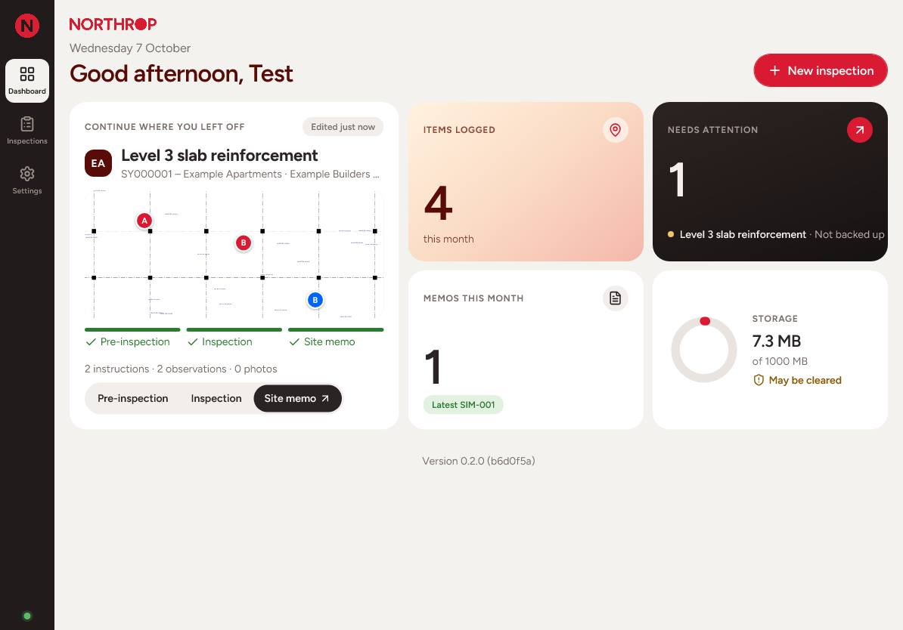
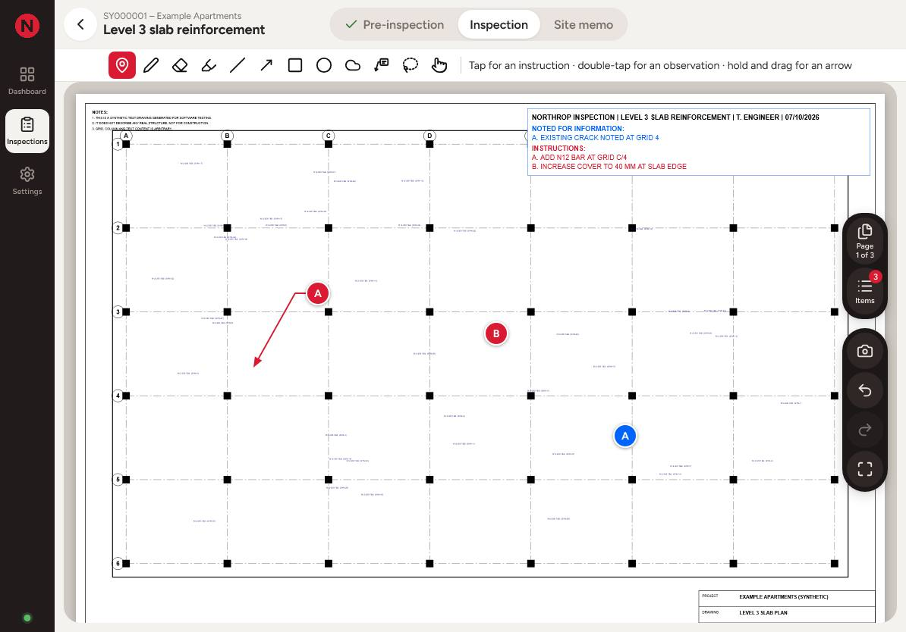

# Summary

Site Inspection Companion is an iPad app for a structural engineer's site inspections. On site, the engineer opens the drawings, drops lettered pins on the areas of concern, marks the drawing up with the Apple Pencil, takes photos and writes instructions. Back in the car or the office, the app turns that into a Northrop **Site Instruction Memo** and exports one PDF pack: the memo, the marked-up drawing pages and a photo appendix.

It is a **proof of concept**, built for one engineer and tested on a real iPad through a full set of manual test plans.

- **No App Store.** It is a web app opened from a link and added to the iPad's home screen, where it runs full screen like any other app.
- **Works offline.** Once opened, everything it needs is stored on the iPad. It never needs the internet on site.
- **No accounts, no server.** All drawings, photos and memos stay on the device. Nothing is uploaded anywhere.
- **Northrop branded.** The memo follows the Northrop sample memo: branding, disclaimer and office details are fixed template text.

## How an inspection flows

1. **Pre-inspection.** Create the inspection under a project (job number, job name, client, address), and load the drawing PDFs before going to site.
2. **Inspection.** On site, open the drawings as one continuous document. Pin instructions and observations, mark up with the Pencil, and take photos.
3. **Site memo.** The memo fills itself from the job and the pinned instructions. The engineer picks the wording, ticks conditions, signs and checks the live preview.
4. **Export.** One tap builds the PDF pack, ready to share by Mail or Files, or to upload to Aconex.
5. **Back up.** The inspection is saved as a single file, to keep or move to another device.

# Features

## Inspections and projects

- Projects hold the job number, job name, client, address and contacts, shared by all of the project's inspections and memos.
- A Dashboard shows the inspection edited last (with a live preview of its busiest drawing page) and opens any of its steps. It also shows items logged this month, inspections that need attention (no project, no memo, or not backed up), memos this month and storage use.
- An Inspections list with search, recent inspections and projects. Swipe a row to delete it (with a confirm).
- Job details save as you type. Nothing has to be filled in before going to site; a memo needs a job number and name.

## Drawings

- Any number of drawing PDFs per inspection, shown as **one continuous document**, every page at the same width. It scrolls with iOS's own smooth scrolling and pinch-zooms around the fingers.
- Large sheets render only what is on screen, at a resolution suited to the zoom.
- A **Pages** view of thumbnails: go to a page, duplicate a sheet, hide pages that aren't needed (restorable), move pages and reorder drawings. The original PDFs never change.

## Pins and items

- Each item is an **instruction** (something the builder must do) or an **observation** (noted for information). Both get a lettered pin: instructions A, B, C… in red, observations A, B, C… in blue.
- Letters follow the document (drawing, page, then order on the page) and re-letter automatically when items are added, deleted, switched or reordered, so there are never gaps.
- GoodNotes-style gestures: tap for an instruction, double-tap for an observation, tap-hold-drag for a pin with an arrow. Several arrows per pin are possible.
- **Copy pin** puts the same item at several spots, on any page.
- Instructions can require **photo confirmation** before the builder proceeds; the memo says so against each one.
- Each page with pins gets a **notes box** listing its instructions and observations, dragged into a clear spot and burned into the exported page.
- **General notes** are observations with no pin, for things that apply to the whole inspection (such as its extent). They're lettered first and listed in every page's notes box.
- The Items panel lists everything by page: tap one to jump to its pin, swipe to delete, drag to reorder and multi-select.

## Markup (Apple Pencil)

- A full-width toolbar: Pin, Pen, Eraser, Highlighter, line, arrow, rectangle, ellipse, revision cloud, text callout, Select and Draw with finger.
- Strokes follow the Pencil exactly. Colours come in editable slots (fluoro for the highlighter); three weights per tool.
- **Draw and hold:** a stroke held still at its end becomes a straight line, or a clean circle, ellipse, rectangle, triangle or polygon, which can be resized before lifting.
- **Text callouts** with a drafting-style dog-leg arrow, placed and moved like pins.
- **Select** by tap or loop: move, resize, **rotate** (one shape or a group), recolour, change weight, duplicate or delete; callouts can be edited from Select.
- Undo and Redo for everything, including a two-finger double-tap.
- Markup is exported as vector, so it stays sharp at any zoom in the PDF.

## Photos

- Take photos with the camera or choose several from the library, per item or as general photos.
- Photos are compressed to a 1600 px working copy for the report; camera originals are kept at full size until saved to the iPad's Photos or Files.
- Captions, a full-screen viewer, and an appendix in the PDF grouped by item (Photo IA1, OA1, G1…).

## Site Instruction Memo

- One memo per inspection, referenced **SIM-001**, **SIM-002**… per job number.
- Filled from the project and inspection: client, address, job, item inspected, inspector, date.
- Recipients (To or Copy), saved to the project's contacts for next time.
- **Prefilled messages** for the body, the standard conditions and the notes box heading, all editable in Settings.
- The instructions appear as the memo's conditions, each rewordable for the memo without changing the item.
- A drawn or uploaded signature, saved once and reused.
- A **live preview** that is the real exported PDF.

## Export and backup

- **PDF pack:** the memo, then each drawing page with pins or markup (at its native sheet size, original vector content kept, pins, arrows, notes box and markup burned in), then the photo appendix. Page numbers run through the pack.
- If letters change after a memo was exported, the app says what changed before it is sent again.
- Exported PDFs and these documents open inside the app with a Back button.
- **Inspection files:** one file per inspection holding its drawings, photos, items, markup and memo, to back up or move to another device. Import never silently overwrites.
- Backup reminders on the Dashboard; **Back up all** in Settings; a storage meter.

# Limitations

These are the known limits of the proof of concept, stated plainly so they can be weighed.

## Data and devices

- **No sync between devices.** Work moves only by exporting and importing inspection files. My details, the Settings signature and projects with no inspections don't travel with them.
- **Data lives in one browser on one device.** iOS can clear a web app's storage, for example if it goes unused for a long time. Backups are the protection; the app asks the iPad to keep its data and reminds the user to back up.
- **One device at a time per inspection.** Importing an inspection that already exists asks to Replace it (overwriting that device's copy) or Keep both.
- **Memo references can clash** if two devices create memos for the same job without importing each other's work. References stay editable.

## Platform

- Designed and tested on **iPad (iPadOS 26) with Apple Pencil**. Android and Windows tablets are untested; a desktop browser works for editing.
- iPadOS only opens the Share sheet straight after a tap, so sharing a PDF or backup is two taps: prepare, then Share.
- The Pencil feels slightly less fluid than native apps such as GoodNotes; a web app has less direct access to the Pencil.

## Performance

- **Large real drawings** (many A1 sheets, large file sizes) haven't been performance-tested yet; that is the next step.
- Scrolling slows on pages with a lot of markup.

## Not in the proof of concept

- No re-inspections, and items have no open or closed status.
- Undo lasts until the app closes, and doesn't cover moving pins or the notes box, or page operations.
- Callout text always stays level (callouts move when a group is rotated, but don't turn).
- No user accounts, sign-in or permissions; one engineer per device.
- The planned calculators (AS 3600) and standard details library aren't built yet.

## Hosting

- The app is served from a **public web page**: anyone with the link can open the app, but no one can see anyone's data, because nothing leaves the device. Hosting on a company server, or a sign-in in front of the link, should be decided before wider use.

# Technology and data

- **Web app (PWA):** TypeScript and React, built with Vite. A service worker stores the app on the device, so it opens and runs offline.
- **Storage:** IndexedDB in the iPad's browser storage, through the Dexie library. Drawings, photos and memos are stored as files inside it.
- **Drawings:** shown with Mozilla's pdf.js; markup and pins are stored as positions relative to each page, so they stay correct at any zoom or sheet size.
- **PDF export:** built on the device with pdf-lib. Drawing pages are copied in as they are (vector), with the markup drawn on top; the memo uses the Northrop template and the Figtree font.
- **Privacy:** no analytics, no external fonts or services, no data sent anywhere. Real drawings may be used in the app because they never leave the device.
- **Quality:** around 285 automated unit tests and 85 end-to-end tests on an iPad-sized browser run before every release, plus a written manual test plan for each feature, run on the iPad.

## How it was built

The app was built by David Samson with an AI coding assistant (Anthropic's Claude Code). David set the requirements, made every design and engineering decision, reviewed each step and tested it on the iPad; the assistant wrote the code and tests under that direction. In line with company policy, no real project drawings, client details or photos were shared with the AI tool: development used synthetic test drawings and made-up job details only. The decisions are recorded in the project's decision log.

# What's next

- **Hardening:** offline and storage tests, performance with large real drawing sets, and smoother scrolling on heavily marked-up pages.
- **Wider use:** decide on hosting (company server or sign-in), and whether syncing between devices is needed. Sync would need a server and accounts, and changes how data is protected.
- **Calculators:** an AS 3600 calculators area (concrete checks, area of steel, development and lap lengths), kept separate from inspections and never in the memo.
- **Standard details library:** searchable details that can be attached to a memo item.
- **Later:** more undo coverage (moving pins and the notes box, page operations).
