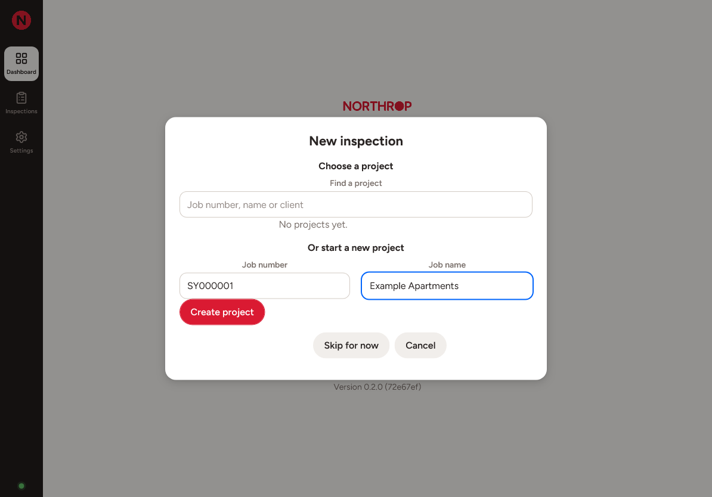
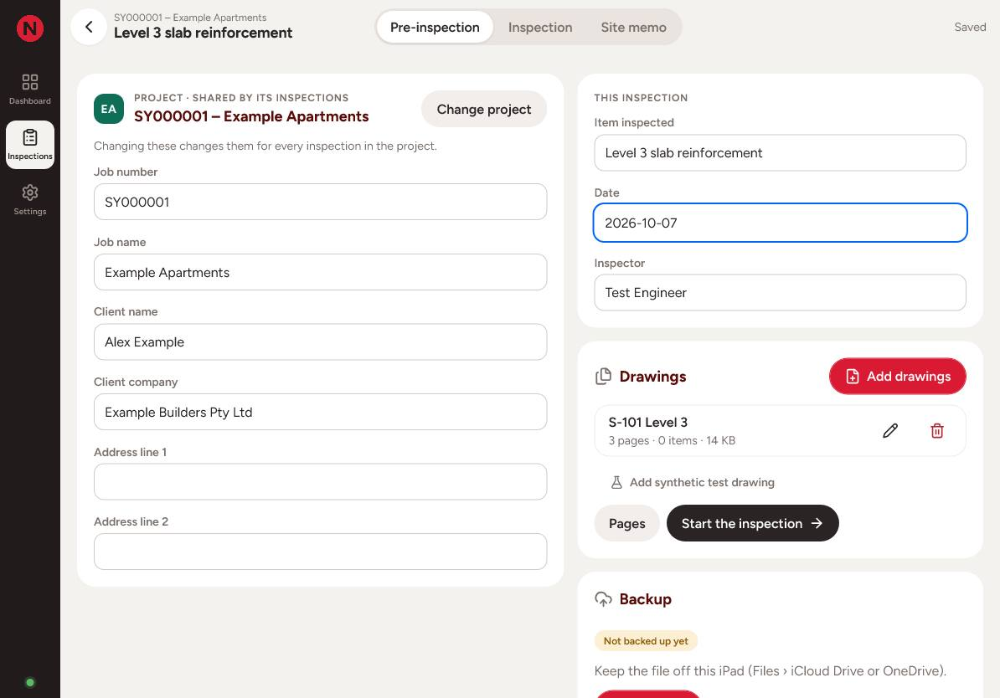
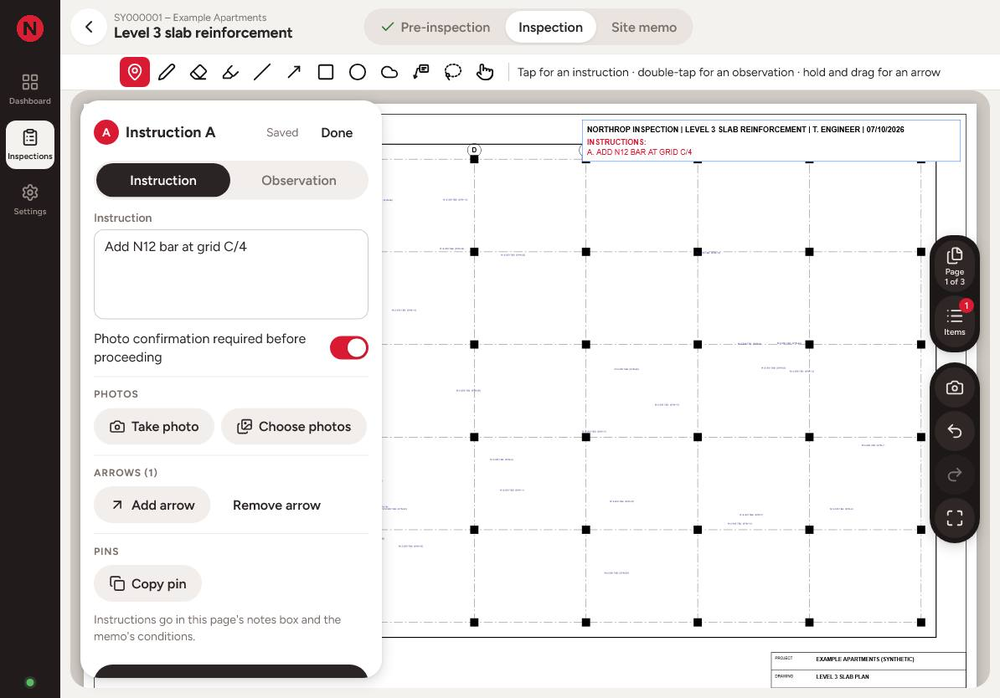
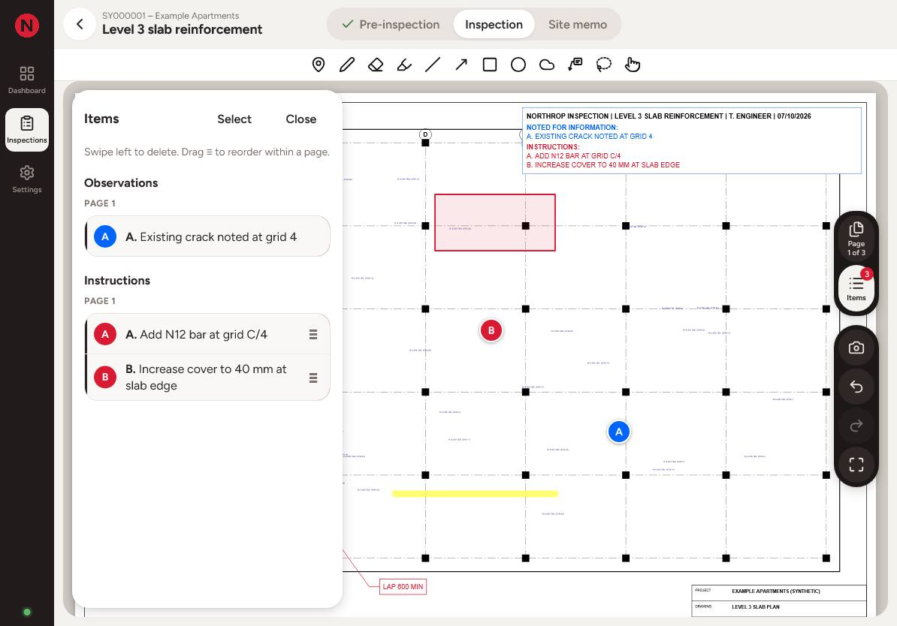
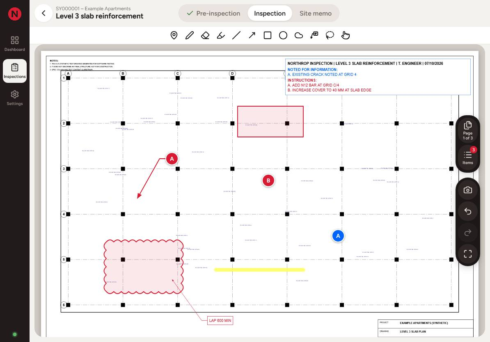
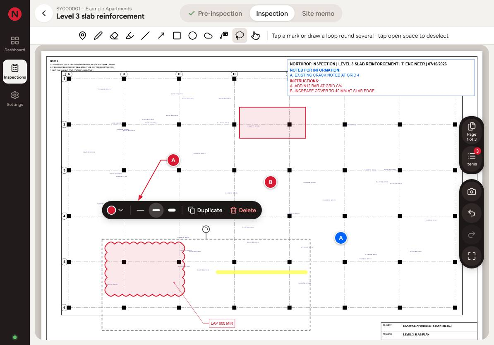
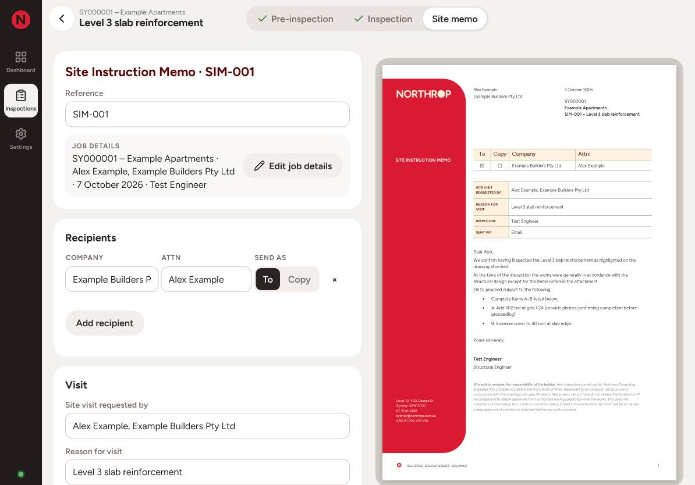
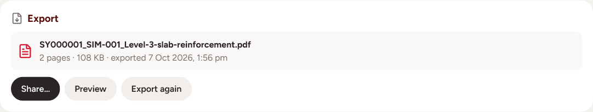
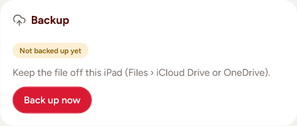

# Getting started

## Install it on the iPad

1. Open the app's link in **Safari** on the iPad.
2. Tap the **Share** button, then **Add to Home Screen**.
3. Open it from the home screen from now on. It runs full screen and works with no internet.

> When an update is ready, the app shows **Update now**. Tap it, or close and reopen the app.

## Set up your details

1. Open **Settings** from the bar on the left.
2. Under **My details**, enter your name and title. They go on new inspections and memos.
3. Draw or upload your **signature**. It's copied into each new memo.

## Keep your work safe

Your work is stored only on this iPad, and iOS can clear a web app's storage. **Back up each inspection** when you finish it (see Backing up), and use **Back up all** in Settings now and then.

# Before you go to site

## Start an inspection

1. On the **Dashboard**, tap **New inspection**.
2. Choose the project, or start a new one with its job number and job name. (You can **Skip for now** and assign a project later.)
3. The inspection opens on **Pre-inspection**.

## Fill in the details and load drawings

1. Check the project details (client, address) and fill in **Item inspected**, for example "Level 3 slab reinforcement". Everything saves as you type.
2. In **Drawings**, tap **Add drawings** and pick the PDFs from Files. Drag the handle to put them in order.
3. Tap **Start the inspection** when you're ready.

# On site

## Getting around the drawings

- All the drawings are one long document. **Scroll with one finger**, **pinch with two** to zoom.
- The **Page** button on the right opens the Pages view: tap a page to go to it. From each page's menu you can duplicate, hide or move it.
- **Fit page** (bottom right) fits the current page to the screen.
- The Apple Pencil never scrolls: it's for pins and drawing.

## Pins: instructions and observations

Turn on the **Pin** tool (first in the toolbar), then:

- **Tap** for an **instruction** (red pin).
- **Double-tap** for an **observation** (blue pin), or to switch an existing pin's kind.
- **Tap, hold, then drag** for a pin with an **arrow** to the spot you mean.

The item's editor opens: type the instruction or observation. For an instruction the builder must prove, turn on **Photo confirmation required**. Tap **Done**, or tap the drawing to close it.

- Tap a pin (with any tool) to open it again; drag it to move it.
- **Add arrow** points the pin at more spots; **Copy pin** puts the same item at another spot.
- Letters are automatic: instructions A, B, C… and observations A, B, C… in order through the drawings.
- The **notes box** on each page lists its items. Drag it somewhere clear: it's printed on the drawing.

## The Items panel

Tap **Items** on the right to list every item by page. Tap one to jump to it, swipe left to delete, drag the handle to reorder items on a page, or tap **Select** to change several at once.

## General notes

For something about the whole inspection rather than one spot, such as "Inspection limited to the roof framing, grids 1–4 / A–C":

1. Open **Items** and tap **Add general note**.
2. Type the note and tap **Done**.

General notes are observations with no pin. They're lettered first (A, B…), before the pinned observations, and every page's notes box lists them. Edit or delete them from the Items panel like any item.

## Photos

- In an item's editor: **Take photo** (camera) or **Choose photos** (library).
- The **camera** button on the right takes a general photo, not tied to a pin.
- Tap a photo to view it full screen and add a caption.
- **Save to iPad** shares the photos to Photos or Files for filing.

## Marking up with the Pencil

Each tool is a toggle: tap it to turn it on, tap again to turn it off. With a drawing tool on, the **Pencil draws** and a **finger scrolls**. (No Pencil? Turn on **Draw with finger**: one finger draws, two scroll.)

- **Pen** and **Highlighter:** pick a weight and a colour slot. Tap the colour in use again for more colours.
- **Shapes:** line, arrow, rectangle, ellipse, revision cloud. Drag from corner to corner.
- **Draw and hold:** draw a shape freehand and hold the Pencil still at the end: it snaps to a clean line, circle, rectangle, triangle or polygon. Keep pressing and drag to make it bigger or smaller.
- **Eraser:** rub over a mark to remove it. Tap inside a filled shape to take its fill off.
- **Text:** tap for a text box, or tap, hold and drag for a box with an arrow. Type in capitals as you like; tap elsewhere to finish.

## Select

Turn on **Select** (the dotted lasso), then tap a mark or draw a loop round several. Quicker still: just **tap any mark you've drawn** (with no tool, the Pen, Highlighter or a shape tool on). Select comes on with it picked, and tapping open space takes you back to your tool.

- **Drag** inside the dashed box to move them.
- The bar above changes the **colour** or **weight**, **duplicates** or **deletes** them.
- One shape shows **handles** to resize it. Tap a selected callout again to edit its text.
- Drag the **round handle** above the selection to **rotate** it (one shape, or a group together). It snaps to level and 45°.
- Tap open space to let go.

## Undo

- The **Undo** and **Redo** buttons on the right undo pins, deletes, markup and more.
- Or **tap twice with two fingers** anywhere on the drawing to undo.

# After the inspection

## The Site Instruction Memo

1. Open **Site memo** and tap **Create memo**. It gets the job's next reference, such as SIM-001.
2. Check the **recipients**: the client starts as "To". Add others as To or Copy.
3. Pick the **message** that fits, and tick the **standard conditions** that apply. Your instructions are listed as conditions; each can be reworded for the memo.
4. Check the **signature** and sign-off.
5. Read the **preview** beside the editor: it's exactly what will be exported.

## Export the PDF pack

1. At the end of Site memo, tap **Export PDF**.
2. When it's ready, tap **Share…** to send it by Mail, save it to Files or upload it to Aconex.
3. The pack holds the memo, the marked-up drawing pages and the photo appendix.

> If you change pins after exporting, the letters may change. The app warns you and lists what changed: export again before sending.

## Backing up

1. Open **Pre-inspection** and find the **Backup** card.
2. Tap **Back up now**, then **Share…** and choose **Save to Files** (or AirDrop it to your computer).
3. To restore or move it to another device, use **Import inspection…** on the Inspections page.

# Gesture cheat sheet

## Fingers

- **One finger:** scroll. **Two fingers:** pinch to zoom.
- **Two-finger double-tap:** undo.
- **Tap a pin or callout:** open it. **Drag it:** move it.

## Pin tool

- **Tap:** instruction pin.
- **Double-tap:** observation pin (or switch a pin's kind).
- **Tap, hold, drag:** pin with an arrow.
- **Double-tap, hold, drag:** observation with an arrow.

## Pencil

- **Draw and hold:** straight line, or a clean shape from a closed stroke; keep dragging to resize it.
- **Text tool:** tap for a box; tap, hold and drag for a box with an arrow.
- **Select tool:** tap a mark, or loop round several; drag inside the box to move; drag the round handle to rotate.
- **Eraser:** rub to remove; tap inside a shape to take its fill off.
